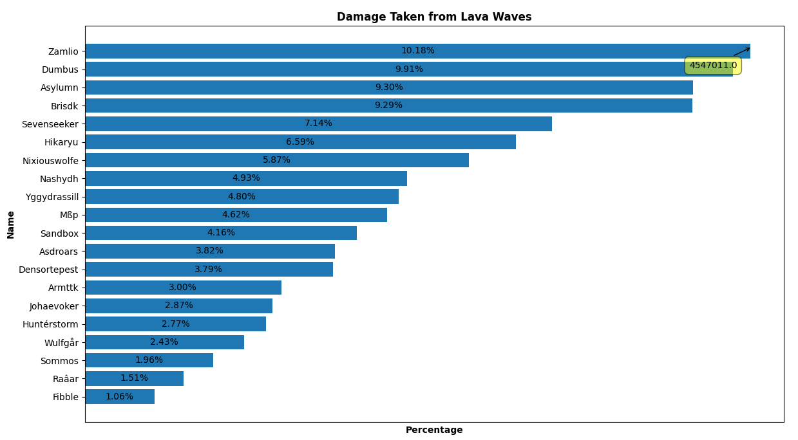
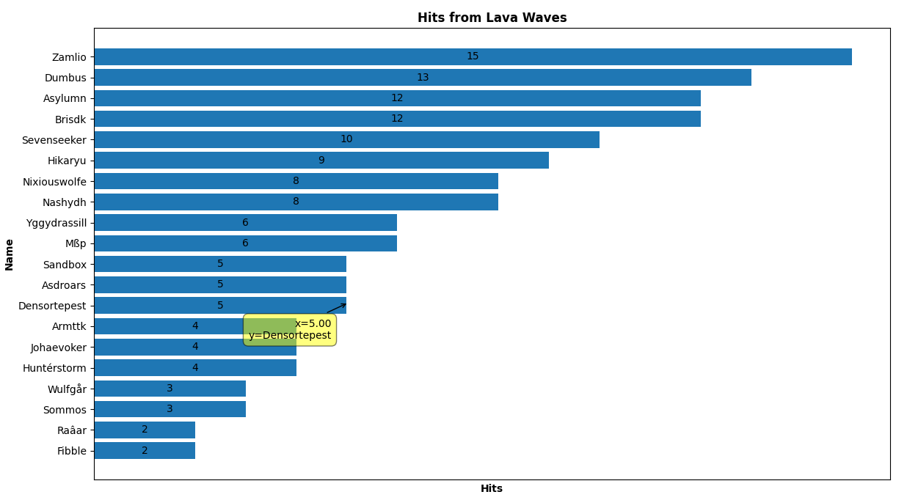

# Python Warcraft Logs Graph

    
    

This program is to test Pandas, with simple graphing of a .csv file from Warcraft Logs to analyse lava wave damage from Mythic Rashok progression.
# Dataset

The dataset, additional metadata, and the .csv file used in this program can be found at:
https://www.warcraftlogs.com/reports/tn6xDFyR23bNGgQV/#type=damage-taken&ability=403543&boss=2680&difficulty=5&wipes=1&cutoff=3

# Contribution 

If you'd like to contribute to `python_warcraft_logs_graph` please submit a pull-request on a feature branch.

# Installing

Clone the repo:

    git clone https://github.com/Sommos/python_warcraft_logs_graph

    cd python_warcraft_logs_graph